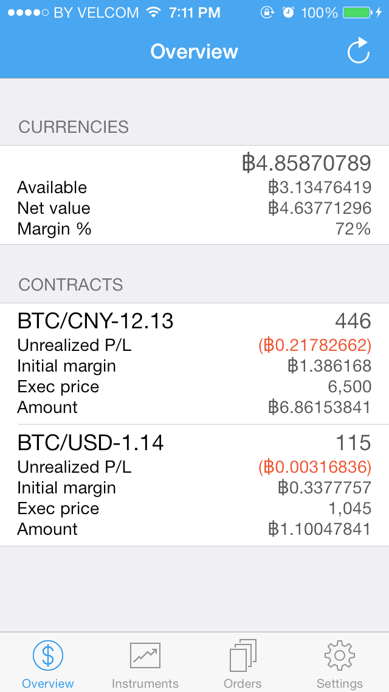

# icbitter

icbitter is an iOS client for the Bitcoin futures market
[icbit](http://icbit.se).



## Development

Before proceeding, make sure
[CocoaPods](http://guides.cocoapods.org/using/getting-started.html) are installed.

To install pod dependencies, run

```bash
$ pod install
```

Then open the workspace that CocoaPods has generated

```bash
$ open icbitter.xcworkspace
```

## TODO

* order creation
* showing only orderbook items that are in session trading range
* charts
* 2FA login support
* connection error/timeout handling

## Contribute

Feel free to open issues and drop pull requests. Follow existing code
style, use 4 spaces over tabs.

## Donate

You can support development of this application by sending donations to
1MK18MnRgaFQJNGCepDtrzf32FL1Hf53ND.

## License

icbitter is released under the [MIT license](LICENSE).
